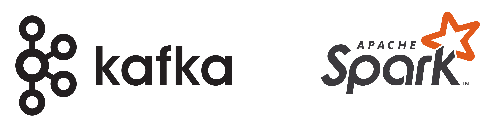
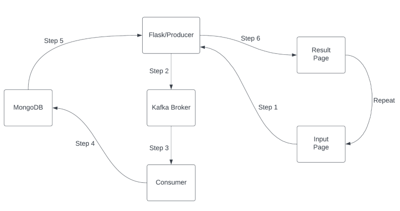

    

# Product Recommendation System
In this project, I worked on building a live product recommender system based on customer preferences using the Amazon product dataset. The data set can be downloaded from [here](https://jmcauley.ucsd.edu/data/amazon_v2/categoryFiles/All_Amazon_Review.json.gz).

# Technologies Used
1. Apache Spark 
2. Apache Kafka
3. Flask
4. Dask
5. MongoDB

# Architecture
Please note that this project was built on Ubuntu. If you want to run it on windows, you might have to do some changes.
### Producer (Flask)
- The Flask application serves as the producer.
- It collects `reviewerID` and `productIDs` from the user through an HTML form.
- These inputs are sent to the consumer for processing.

### Consumer (Apache Spark)
- The consumer processes the data received from the producer.
- It uses a machine learning model to generate product recommendations.
- The recommendations are saved in a MongoDB database.

### Data Flow
1. **User Input**: The user enters `reviewerID` and `productIDs` on an HTML page.
2. **Send to Consumer**: Flask sends these inputs to the Apache Spark consumer.
3. **Model Processing**: The consumer processes the inputs using a recommendation model.
4. **Save to MongoDB**: The generated list of recommended products is saved in MongoDB.
5. **Fetch Results**: After a 10-second delay, Flask fetches the latest entry from MongoDB.
6. **Display Results**: The results are displayed on a `result.html` page.

The following flowchart describes the whole cycle:

    

# How to run
1. Open terminal and run `git clone https://github.com/HAPPYLAMMA2001 product-recommendation-system.git`
2. Navigate to `product-recommendation-system`.
3. Run `pip install -r requirements.txt`.
4. Run kafka zookeeper and servers in seperate terminals.
5. Run `python3 app.py` and `python3 consumer.py` on seperate terminals.
> Make sure you have kafka and spark installed and configured for running with python. You might face issues with connectivity between Mongodb and Pyspark. You can read my article which might solve your issue. [Link to article](https://medium.com/@HAPPYLAMMA2001/pyspark-and-mongodb-integration-connection-error-fixes-on-windows-8158d144bd2c)

For detailed information you can read my detailed reports:
1. [EDA](resources/EDA.pdf)
2. [Model Training](resources/Preprocessing_Training.pdf)

> **Note**: This project is intended solely for educational purposes and is not for commercial use. Happy Coding 🙂.